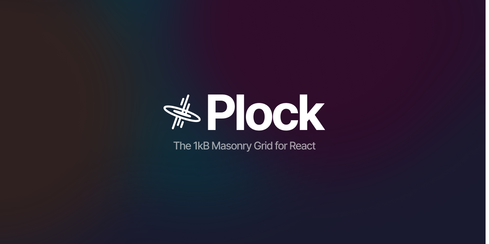

React Plock is a tree-shakeable **ultra small** npm package (**less than 1kB gzipped**) that allows you to create amazing masonry layouts with an amazing developer experience. With React Plock, you can easily create responsive and customizable layouts that adapt to different screen sizes and devices.

### Features

- **Masonry Layout**: Create beautiful masonry layouts with ease.
- **Responsive**: Automatically adapts to different screen sizes and devices.
- **Customizable**: Customize the layout to match your needs.
- **TypeScript Ready**: Get the strength of type-safe languages.
- **Amazing DX**: Easy to use and well-documented.

### Examples

- Using Next.js 14 (Server Components) [See Working Demo](https://react-plock-with-nextjs.vercel.app/)
- Using ViteJS [See Working Demo](https://react-plock-with-vite.vercel.app/)

### Installation

```bash
npm install react-plock
```

### Usage

Using Plock with the new v3 APIs it's a piece of cake. Here's an example of how can you create an [Unsplash-Like](https://unsplash.com/) masonry grid. You can even see a demo of this example by clicking [here](https://react-plock.netlify.app/).

```tsx
import { Masonry } from 'react-plock';

const ImagesMasonry = () => {
  const items = [...imageUrls];

  return (
    <Masonry
      items={items}
      config={{
        columns: [1, 2, 3],
        gap: [24, 12, 6],
        media: [640, 768, 1024],
      }}
      render={(item, idx) => (
        
      )}
    />
  );
};
```

### API Reference

Here's the TypeScript definition for the Masonry Component, below you can find a more detailed explanation.

```ts
export type MasonryProps<T> = React.ComponentPropsWithoutRef<'div'> & {
  items: T[];
  render: (item: T, idx: number) => React.ReactNode;
  config: {
    columns: number | number[];
    gap: number | number[];
    media?: number[];
  };
  as?: React.ElementType;
};
```

#### Items

This prop accepts a generic array of elements, each one will be passed to the **render** property.

#### Render

The masonry render prop. Here's where you define the styles of every tile of the grid, the function takes the current looping item and the relative index.

#### Config

A configuration object that is used to define the number of columns, media queries and gaps between items.

#### Other Props

As you can see, by using `React.ComponentPropsWithoutRef<"div">` you can simply pass every available property to the div, some examples are **id** and **className**. The only one property that will be overwritten will be the `style` because is used internally for the masonry generation.

### Important Note

Please, note that in case you are passing an array to the columns attribute of the config property, the number of elements **MUST** be equal to the number of media AND gap breakpoints provided!

```tsx
// Correct: This will be responsive with 3 breakpoints.
<Masonry
  {...otherProps}
  config={{
    columns: [1, 2, 3],
    gap: [12, 16, 20],
    media: [640, 768, 1024],
  }}
/>

// Correct: This will be responsive with 2 breakpoints.
<Masonry
  {...otherProps}
  config={{
    columns: [1, 2],
    gap: [2, 4],
    media: [640, 1024],
  }}
/>

// Correct: This will be fixed with 4 columns in every screen size.
<Masonry
  {...otherProps}
  config={{
    columns: 4,
    gap: 8
  }}
/>

// NOT Correct: This will cause trouble in rendering.
<Masonry
  {...otherProps}
  config={{
    columns: [4],
    media: [640, 768],
  }}
/>
```
